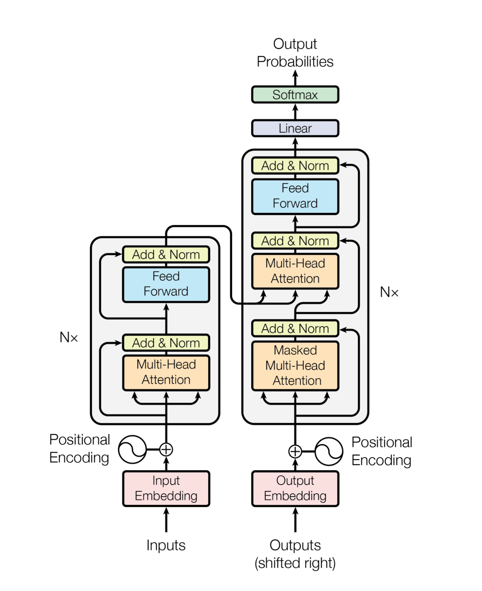
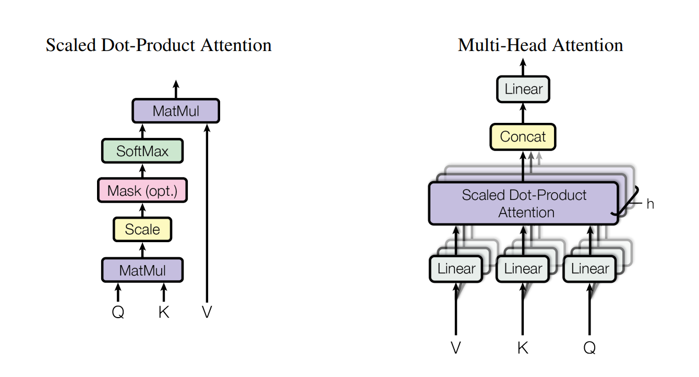

# Transformers Code Playground with PyTorch
This project is designed for experimentation of the Transformer architecture using PyTorch. Whether you're new to Transformers or looking to dive deeper into their implementation, this repository provides a space for you to explore and experiment with the code.

Note: This project is strictly for educational and experimental purposes. Nothing here is intended for production use. Please use this code responsibly and ethically.

## Architecture


The Transformer is a state-of-the-art deep learning model used for various natural language processing tasks. It consists of two main components: the encoder and the decoder.

The encoder processes the input sequence by applying self-attention mechanisms, which calculate the importance of each word in the context of the entire input sequence. This self-attention is performed using multi-head attention, which means that it considers multiple aspects of the input simultaneously. The math behind self-attention involves calculating weighted sums of the input tokens based on their relevance to each other.

The decoder, on the other hand, generates the output sequence by also employing self-attention, but it additionally uses cross-attention to focus on relevant parts of the encoder's output. Cross-attention allows the model to understand how different parts of the input sequence influence the generation of the output.

Both the encoder and decoder consist of multiple layers, and the final prediction is made by applying fully connected layers and softmax functions. The Transformer's architecture, with its multi-head attention and layer-wise feedforward networks, has proven highly effective for a wide range of NLP tasks.



1. Query (Q): The query is a representation of a specific word in the input sequence that we want to focus on. For example, if we're processing the word "apple" in the input, "apple" would be the query.

2. Key (K): The key represents the words in the input sequence and helps determine the relevance of each word to the query. Each word in the input has an associated key.

3. Value (V): The value represents the information contained in the words of the input sequence. The value is used to compute the weighted sum that the model assigns to each word based on its relevance to the query.

The self-attention mechanism involves calculating a weighted sum of values, where the weights are determined by the similarity between the query and the keys. The similarity between the query and keys is computed using a dot product, and then it is scaled and passed through a softmax function to ensure that the attention weights sum up to 1. This weighted sum of values becomes the output for the word at the query position, reflecting its context with respect to the other words in the sequence.

In multi-head attention, multiple sets of query, key, and value projections are employed in parallel. Each head learns to focus on different aspects of the input sequence, allowing the model to capture diverse patterns and relationships within the data. The results from each head are concatenated and linearly transformed to obtain the final output of the self-attention layer.

## Getting Started
Before you start exploring and experimenting with the Transformer architecture, you'll need to set up your environment. Here's how to get started:

## Installation
Clone this repository to your local machine:

```bash
git clone https://https://github.com/garyb9/pytorch-transformers.git
cd pytorch-transformers
```

Install the required dependencies by running the following command:

```bash
pip install -r requirements.txt
```

## Usage
Feel free to modify and extend the transformer_playground.py script to experiment with different configurations, hyperparameters, and datasets. You can also use this project as a starting point for your own experiments with Transformers.

## Contributing
If you find any issues or have ideas to improve this code playground, please feel free to open an issue or submit a pull request. Contributions are welcome!

## License
This project is provided under the MIT License. You can use, modify, and distribute the code, but please make sure to review the license for full details.

Remember, this project is designed for learning and experimentation with Transformer architecture using PyTorch, and nothing in this project should be used in a production environment.

Enjoy exploring the world of Transformers, and happy coding!
